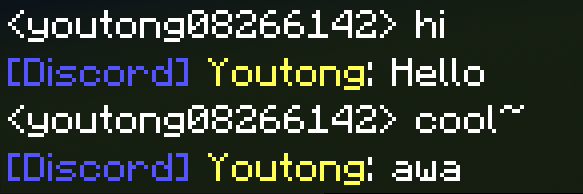
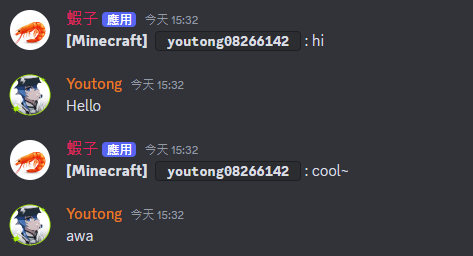

# Chat Bridge for Discord and Minecraft
讓人們在 Discord 與 Minecraft 之間聊天吧 ! (僅限基岩版)

### 使用條件:
* Minecraft BE
* Python >= 3.8

### 使用方法:

#### 設定:

使用以下指令來下載所需套件
``` 
pip install -r requirements.txt 
```

在最外層創建 `.env` 檔案並寫入你的 Discord 機器人 Token
```
TOKEN="Your Discord Bot Token"
```

接著到 `discord.json` 設定訊息的頻道 id

`setting.json` 可以設定主機位址

#### 啟用:
設定完畢後進入 `src/` 執行 `main.py`，任何可以啟動 python 檔案的方法都行
接著回到 Minecraft 世界，輸入指令 `/wsserver host:port` (e.g `/wsserver 127.0.0.1:9000`)
這樣就成功啦 !


#### 預覽:



